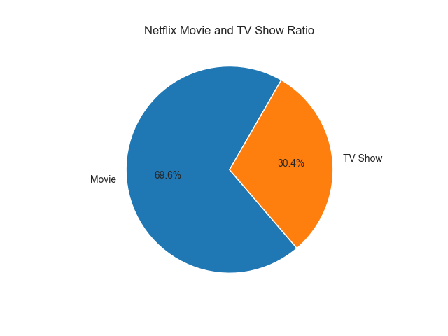
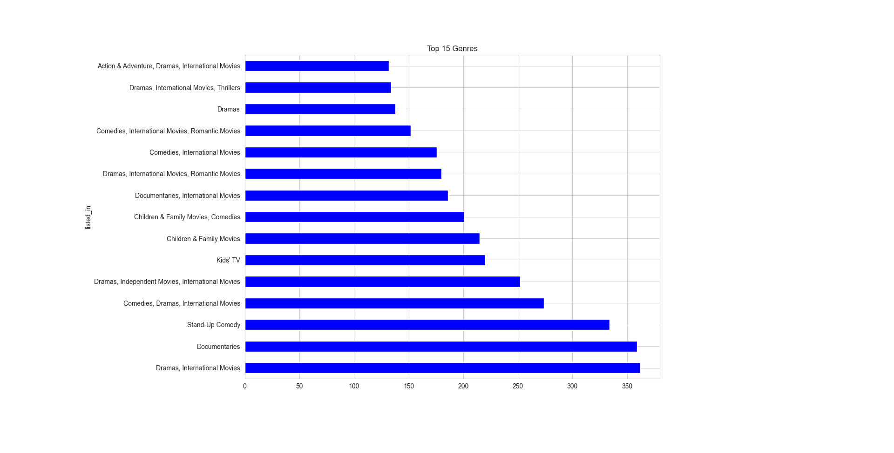
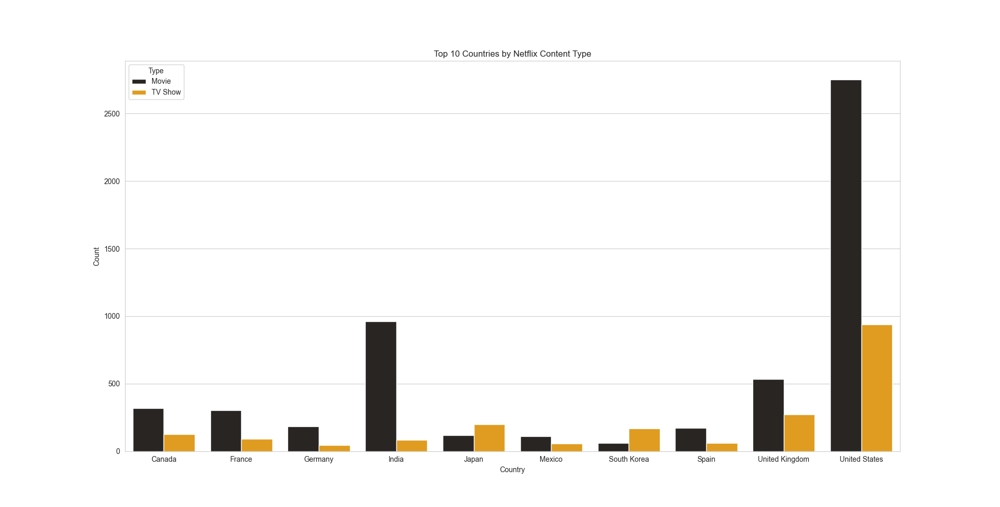
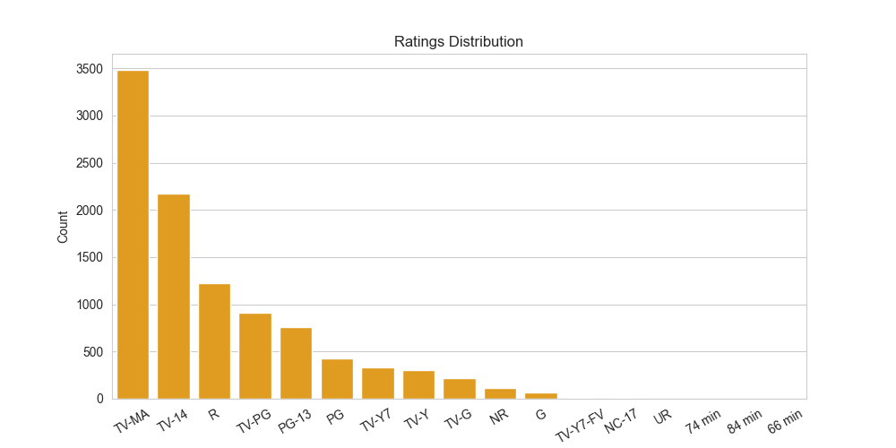
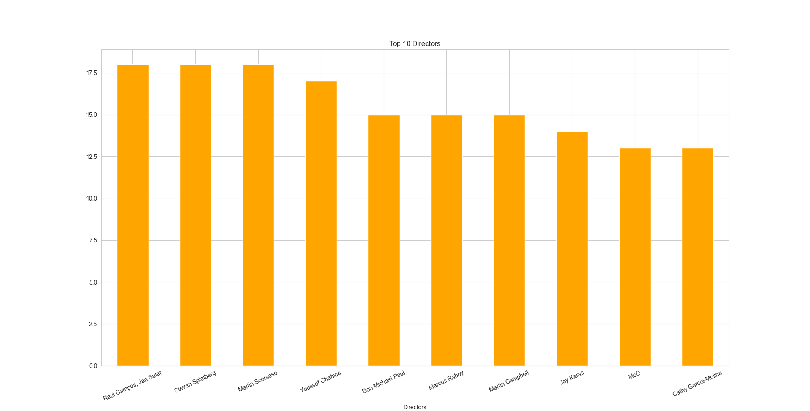

Netflix Data Analysis

This project analyzes the **Netflix Movies and TV Shows dataset** to discover basic insights about the content available on the platform.  
---
Dataset: https://www.kaggle.com/datasets/zubairamuti/netflix-movies-and-tv-shows-dataset
---
- Ratio of **Movies vs TV Shows**
- **Top 15 Genres** on Netflix
- **Top 10 Countries** that produce the most content
- **Ratings Distribution** (G, PG, R, TV-MA, etc.)
- **Top 10 Directors** with the most titles
---
Tools Used
- Python  
- Pandas    
- Matplotlib  
- Seaborn  
---
Visualizations
| Visualization | Description |
|----------------|-------------|
|  | Ratio of Movies vs TV Shows |
|  | Top 15 most popular genres |
|  | Top 10 countries producing the most content |
|  | Ratings distribution (G, PG, R, TV-MA, etc.) |
|  | Directors with the most titles |
